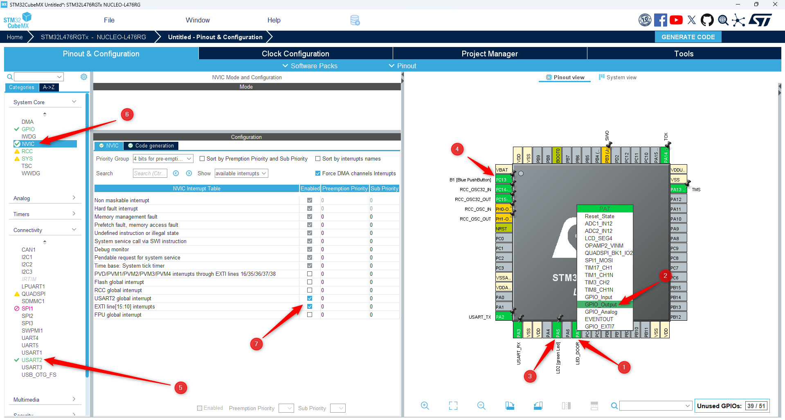
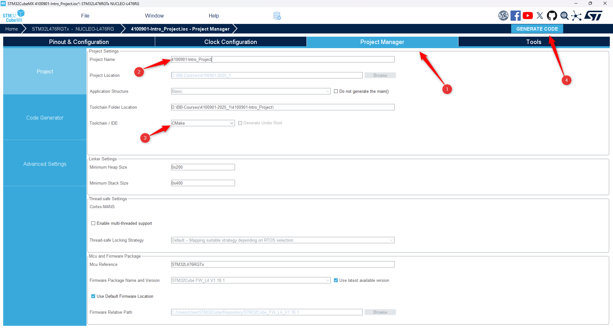

# Configuración del Proyecto con STM32CubeMX

En esta sección, utilizaremos la funcionalidad de STM32CubeMX para configurar los periféricos necesarios de la placa Nucleo-L476RG.

## 1. Crear un Proyecto en STM32CubeMX

1. Abre STM32CubeMX y selecciona **New Project**.
2. Busca la placa "NUCLEO-L476RG" usando el *Board Selector*.
3. Al iniciar el proyecto, selecciona configurar los periféricos por defecto.
4. En la pestaña **Project Manager**, elige:
   * Project Location: La carpeta clonada.
   * Project Structure: Advanced
   * Toolchain: CMake

## 2. Configuración de Periféricos

Sigue estos pasos en la interfaz de STM32CubeMX:

### 2.1 Configuración del Reloj (Clock Configuration)

1.  Ve a la pestaña **"Clock Configuration"**.
2.  Busca el cuadro **"HCLK (MHz)"** e introduce `80`. STM32CubeMX intentará ajustar automáticamente las fuentes y divisores para alcanzar los 80 MHz. Asegúrate de que no haya errores marcados en rojo.
3.  Verifica que la fuente de reloj para `USART2` (conectado al bus APB1) sea `PCLK1`.

### 2.2 Configuración de Pines (Pinout & Configuration)

Ve a la pestaña **"Pinout & Configuration"**.

1.  **LED Integrado (LD2):**
    *   Localiza el pin **PA5** en el diagrama del chip.
    *   Haz clic sobre él y revisa que **`GPIO_Output`** está seleccionado.
    *   Haz clic derecho en PA5 para ponerle una etiqueta de usuario (User Label) como `LD2`.

2.  **LED Externo (Simulador de Cerradura):**
    *   Vamos a usar otro pin GPIO. Por ejemplo, **PA7**.
    *   Haz clic en **PA7** y selecciona **`GPIO_Output`**.
    *   Asígnale una etiqueta de usuario como `LED_EXT`.
    *   *Nota:* Deberás conectar físicamente un LED (con su resistencia limitadora) entre el pin PA7 y GND.

3.  **Botón Integrado (B1):**
    *   Localiza el pin **PC13**. Ya debería estar configurado por defecto como `GPIO_EXTI13` (External Interrupt).
    *   Verifica que su configuración en `System Core > GPIO > PC13` sea:
        *   GPIO mode: `External Interrupt Mode with Falling edge trigger detection`.
        *   GPIO Pull-up/Pull-down: `No pull-up and no pull-down` (la placa Nucleo ya tiene un pull-up externo para este botón).
    *   Asígnale una etiqueta de usuario como `B1`.

4.  **Comunicación UART (USART2):**
    *   En el panel izquierdo, expande **"Connectivity"** y selecciona **`USART2`**.
    *   Mode: Selecciona **`Asynchronous`**.
    *   Configuration -> Parameter Settings:
        *   Baud Rate: `115200` Bits/s
        *   Word Length: `8 Bits` (con paridad incluida si se usa)
        *   Parity: `None`
        *   Stop Bits: `1`
    *   Configuration -> NVIC Settings:
        *   Marca la casilla **"Enabled"** para `USART2 global interrupt`. Esto permitirá que el microcontrolador reaccione cuando lleguen datos por UART sin detener el programa principal.

5.  **Configuración de Interrupciones Externas (NVIC):**
    *   En el panel izquierdo, ve a **`System Core > NVIC`**.
    *   Busca la línea **"EXTI line[15:10] interrupts"** (PC13 corresponde a la línea EXTI 13, que está en este grupo).
    *   Asegúrate de que la casilla **"Enabled"** esté marcada. Esto permite que la interrupción del botón funcione.

## 3. Generación del Código

1.  Ve a la pestaña **"Project Manager"**.
2.  En la sub-pestaña "Project":
    *   Dale un nombre al proyecto (ej. `4100901-Room_Control-CubeMX`).
    *   Asegúrate de que la `Toolchain / IDE` esté configurada como **`CMake`**. 
3.  Haz clic en el botón **"Generate Code"** (usualmente un icono de engranaje o un botón con ese texto).
4.  STM32CubeMX generará/actualizará los archivos de configuración y el código de inicialización HAL en tu proyecto dentro de las carpetas `Core` y `Drivers`.

### 4. Importar el Proyecto en VS Code

1.  Abre VS Code.
2.  Ve a `STM32` > `Import CMake Project`.
3.  Navega hasta la carpeta que acabas de clonar (`4100901-Room_Control-CubeMX`) y selecciónala.
4.  VS Code debería detectar que es un proyecto STM32 (gracias al archivo `CMakeLists.txt`) y la extensión STM32 te podría ofrecer configurarlo.

¡La configuración del hardware está lista! Ahora vamos a escribir la lógica de la aplicación.

**Siguiente Paso:** [Lineamientos para escribir librerias (LIB_PRINCIPLES.md)](LIB_PRINCIPLES.md)
